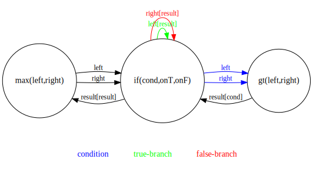
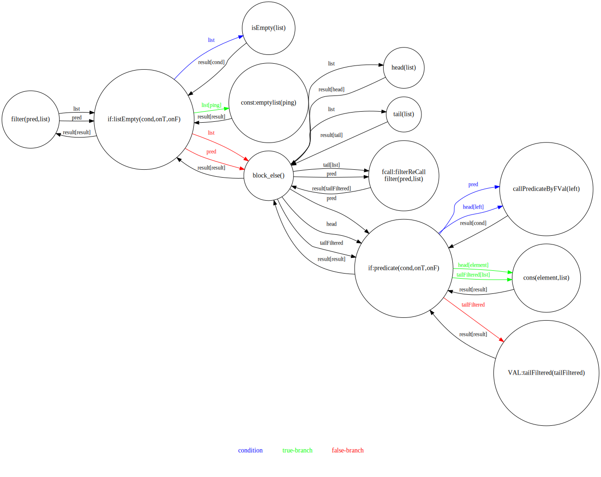
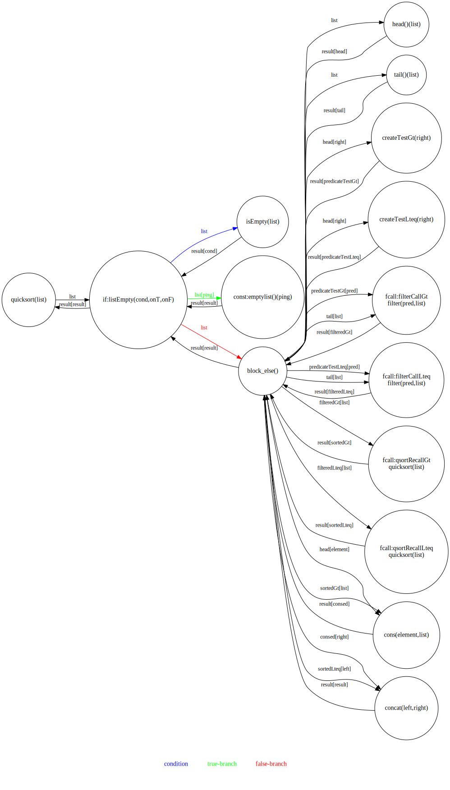
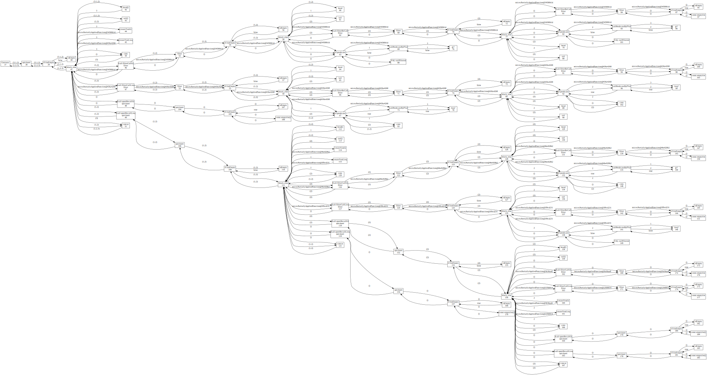
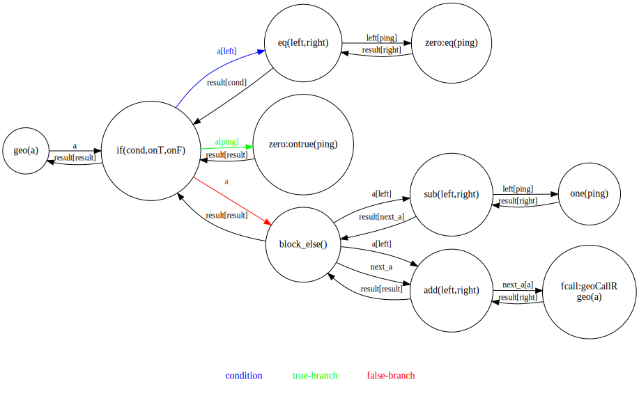
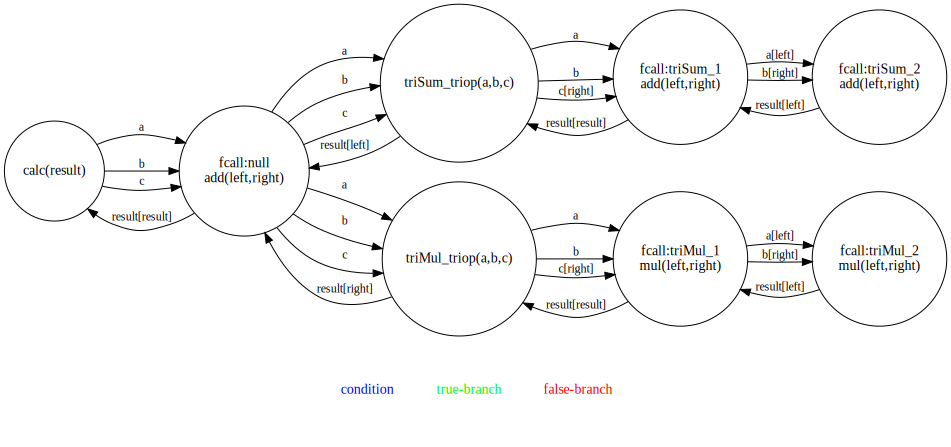

# picoservice
A parallel, persistent and distributed execution model for some functional language constructs based on asynchronous buffered message passing

- A single inherently parallel model of computation for local and distributed algorithms
- Persistent, recoverable execution state using event logging 
- To be embedded in a host language, avoiding new language constructs

**_pico_**? Well, micro (obviously) and [nano](https://www.serverlessops.io/blog/rise-of-the-nanoservice) already have been occupied.

## ingredients

Constants, immutable values and Functions. They may be
- recursive (optionally tail call optimized)
- partially applied
- of higher order, accepting functions as arguments
- a conditional
- primitive, this might be on the level of `+`, `-`, `>` or `<=`, but it could be as well a call of a connector to an external data provider, expensive both in terms of time and of money charged.
- a side effect

## why?

- It started with the quest for the smallest possible microservice, like `+` or `!` as a service (I rather won't tell how that came about). Really, really micro. Which was also a means to understand actor systems, event sourcing and, as it turned out, different models of computation.

- A single approach promised to cover 4 issues at once (parallel distributed and local computation, persistent execution state).

- At the end it looked like it may be suitable for long running processes like you have them in workflow systems, just that you write your workflows in a plain programming language (with quite some annotations).

## concurrent message passing

A function receives named values as messages and propagates them to subsequent functions as needed. Each function is an actor, so all off them operate concurrently. 

Message passing undermines usual function call semantics. You could have function A calling function B and B already computing a result while A hasn't received all its parameters yet (but enough for B).
On the other hand primitives, usual conditionals, tail call optimized recusive functions and functions with functional parameters may need to stash parameters until the computation can proceed (until all parameters have been received to computa a primitive, until the functional value has been provided and can be applied, the condition has been computed and the chosen branch can execute, the next recursive call can execute).  

Further, if it is a primitive and got all values to compute a result it does so and propagates the result to the designated recipient. 
Any non primitive function that receives a result value propagates it to its own designated recipient of a result.

A [conditional is a function](https://stackoverflow.com/questions/58316588/how-to-model-if-expressions-with-actor-systems) with signature: `if(condition, value_true_branch, value_false_branch)` and comes in two flavors. One is the usual semantics where either the true- or false-branch get evaluated on
the condition. The second flavour calculates all 3 elements concurrently and returns the result of one branch as soon as the condition and all necessary parameters are available.

Let's say a function `C` that takes 2 values (`a`, `b`) and subtracts the smaller one from the bigger one. It consists of 3 primitive functions (`>` and 2 times `-`, say `-t`, `-f`) and one `if`.


That's a possible sequence of events, le's say `X`->`a`->`Y` means `X` sends `a` to `Y` and let's assume a caller `Γ`.

```
1  Γ -> a -> C
2  C -> a -> if 
3  Γ -> b -> C
4  C -> b -> if
5  if -> a -> >
6  if -> b -> >
7  > -> condition -> if
8  if -> a -> -t
9  if -> a -> -f
10 if -> b -> -t
11 if -> b -> -f
12 -t -> value_true_branch -> if
13 -t -> value_false_branch -> if  
14 if -> result -> C
15 C -> result -> Γ 
```
Note, that it could as well happen that way.

```
1  Γ -> b -> C
2  Γ -> a -> C
3  C -> a -> if 
4  if -> a -> >
5  if -> a -> -t
6  if -> a -> -f
7  C -> b -> if
8  if -> b -> >
9  if -> b -> -t
10 > -> condition -> if
11 -t -> value_true_branch -> if
12 if -> b -> -f
13 if -> result -> C
14 C -> result -> Γ 
15 -t -> value_false_branch -> if  
```

## algorithms

...expressed in the elements of the execution model (its byte code, kind of)

[max](https://github.com/curiosag/picoservice/blob/master/src/test/java/micro/Algorithm.java#L338)

    max(left, right) = if(left > right) left else right



A [functional version of quicksort](https://github.com/curiosag/picoservice/blob/master/src/test/java/micro/Algorithm.java#L18)
together with a higher order [filter-function](https://github.com/curiosag/picoservice/blob/master/src/test/java/micro/Algorithm.java#L98). Multiple quicksorts could be executed in parallel. The execution can be recovered and resumed from every point of its event log.
The filter and quicksort pseudocode follow closely the actual structures, which try to keep things straight forward in terms of the chosen model.


        given predicate: arg -> boolean

        function filter(list, predicate) = {
            iff (list == []){
                []
            } else {
                let head = head(list);
                let tail = tail(list);
                let tail_filtered = filter(tail, predicate)
                iff (predicate(head))
                    head :: tail_filtered
                else
                    tail_filtered
            }
        }



        given lteq: (u,v) -> boolean

        function quicksort(list) = {
            iff (list == []){
                []
            } else {
                let head = head(list);
                let tail = tail(list);
                let testGt = lteq(_, head) // partially applied function
                let testLteq = lteq(_, head)  // partially applied function
                let filteredGt = filter(tail, testGt)
                let filteredLteq = filter(tail, testLteq)
                let sortedGt = quicksort(filteredGt)
                let sortedLteq = quicksort(filteredLteq)
                sortedLteq ::  head :: sortedGt
            }
        }



The trace of sorting the list (3,1,2).




Recursive calculation of [simple geometrical series](https://github.com/curiosag/picoservice/blob/master/src/test/java/micro/Algorithm.java#L162) with another [tail recursive version](https://github.com/curiosag/picoservice/blob/master/src/test/java/micro/Algorithm.java#L208) thereof.

    geo(n) = 1 + 2 + ... + n-1 + n



A trace of the execution of geo(3) without tail call optimization.


Nested functions forming an [arithmetic expression](https://github.com/curiosag/picoservice/blob/master/src/test/java/micro/Algorithm.java#L259)

    f(a,b,c) = (a*b*c)+(a+b+c)




They're right now only run (then step-wise recovered and re-run) by the project's [unit tests](https://github.com/curiosag/picoservice/blob/master/src/test/java/micro/MicroTest.java).


## event logging/recovery

A log of events causing state change is used to restore the computation state and resume the compuation from the last operations logged.
The implementation turned out to be a magnitude more messy with event sourcing built in. Perhaps just for the sake of clarity there should be a non-event-sourced version provided.

## TODO

A all kind of stuff is missing, among that

- a model of the implemantation that allows to derive some charasteristics and guarantees, e.g. monotonicity. As far as it [is stated](http://bloom-lang.net/calm/) for the bloom language it should be spot-on.
- perhaps restrict message passing to match conventional function call semantics   
- location transparency for function calls
- remove restriction to a single functional parameter
- primitives for sets and maps 
- mutability maybe
- value de-duplication in event logs
- add scatter/gather semantics at least, see [this](https://dsf.berkeley.edu/papers/cidr11-bloom.pdf) for consistency requirements
- a compiler and integration to a source language. There shouldn't be a 2nd form needed for programs to get a picoservice-executed function   
- find a field of application, perhaps long running processes with big chunks as primitives like in a workflow system, just that you write your workflows in plan Java or whatever
- travel backwards in time to the 70ies to find hardware that is actually supportive of this kind of parallelism.


## somewhat related

- [actor systems](https://en.wikipedia.org/wiki/Actor_model)
- [propagation systems](https://www.cs.tufts.edu/~nr/cs257/archive/alexey-radul/phd-thesis.pdf)
- [salsa actor language](http://wcl.cs.rpi.edu/salsa/)
- [process networks](https://en.wikipedia.org/wiki/Kahn_process_networks)
- [bloom](http://bloom-lang.net/calm/) programming language, but less so
